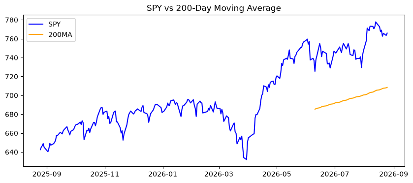
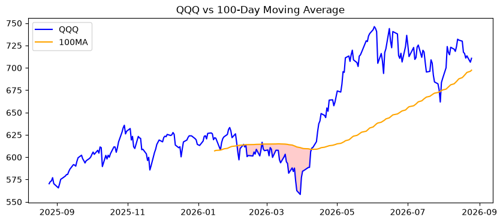
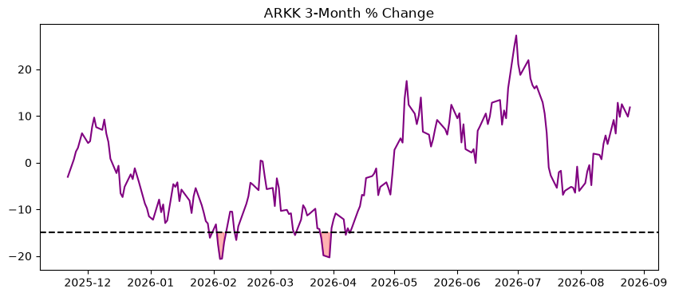
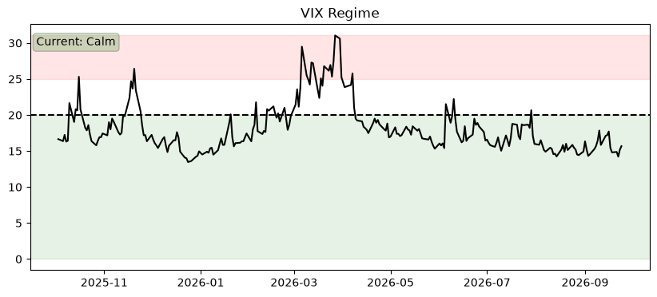
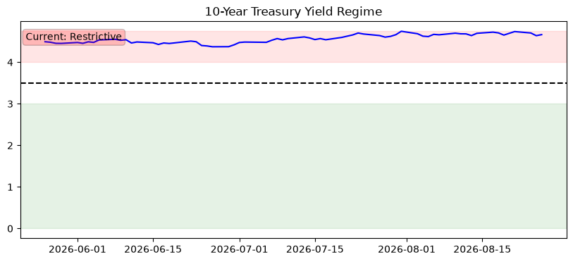
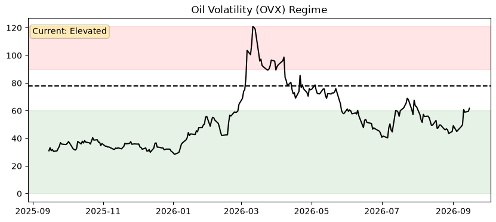
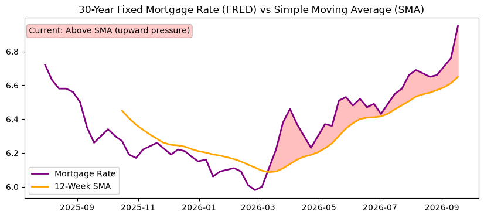
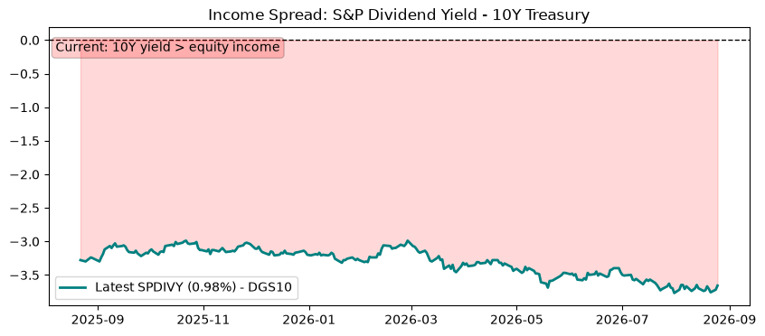

# Market Risk Monitor

**🟢 Recovery**  
**Score:** Downturn 0/3 | Recovery 3/3  
**Last Updated:** 2026-08-26

---

⚠️ **Disclaimer**

This is an automated market signal summary for informational purposes only.
It is not financial advice.

A note from the author:
There are hundreds of resources on the Internet in addition to learning resources available through your investment platform.
For example, [this one by Ramit Sethi](https://youtu.be/FF5-FbhaAyc?si=52cXbGUBFqxifu7Q), or [this one by Jaspreet Singh](https://youtu.be/qdqLIjszqy4?si=-R0Sa7C_Q0bCHY08), or [this one by Erin Moriarity](https://youtu.be/FYMfX3Aljow?si=MPQ7nICG0nA1U6vh), or articles like [this one by Fidelity](https://www.fidelity.com/learning-center/smart-money/roth-ira-taxes).
Seek out the information you need for your future self!

---

## AI Risk Commentary

**Risk Commentary:**  
Market conditions remain stable amid a recovery regime, with equities trading above key moving averages and volatility subdued. Risk appetite persists as bond yields stay elevated but income spreads continue to favor fixed income, tempering aggressive positioning.

**Market Summary:**

- **Mortgage**: Rate at 6.65%; condition is Neutral — stable  
- **Income Spread**: SP dividend yield at 0.98% vs. 10-year yield at 4.64%; spread is -3.66% — favoring **bonds**  
- **VIX**: At 15.45, indicating low volatility — stable  
- **SPY Trend**: Trading at 765.91, above 200-day MA of 708.43 — bullish; stable  
- **Yield Context**: 10-year yield at 4.66%; TNX stable within recent range  
- **Raw data available in /data**

---

## Charts

### SPY Trend

### QQQ Trend

### ARKK Drawdown

### VIX

### 10Y Yield

### Oil Volatility

### Mortgage Conditions

### SPY Trailing Dividend Yield (proxy)

---

[View raw data](data/market_snapshot.json)

---

## RSS Feed

https://kam-reef.github.io/market-summary/feed.xml

---

## Data

- Signals: [data/signals.json](data/signals.json)  
- History: [data/history.json](data/history.json)
