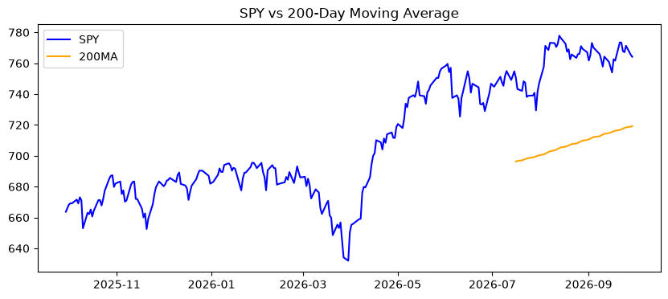
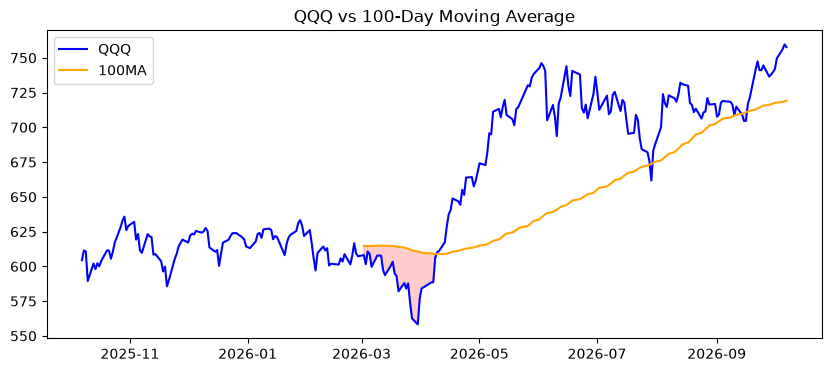
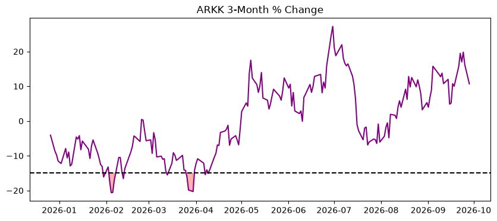
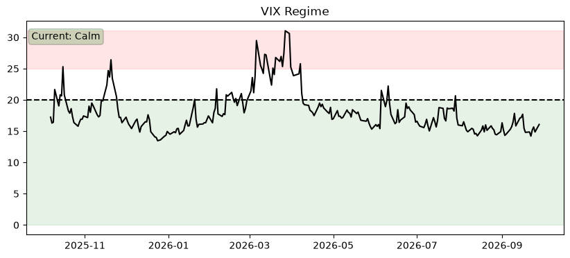
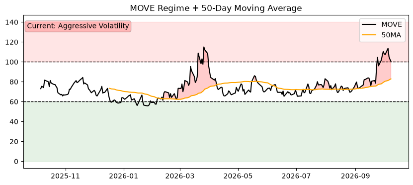
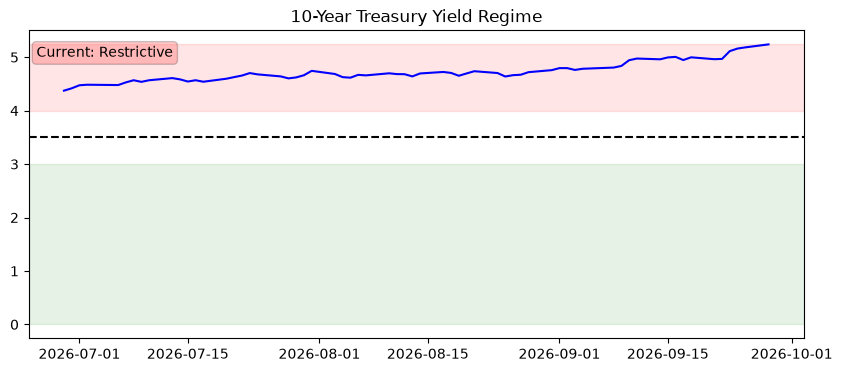
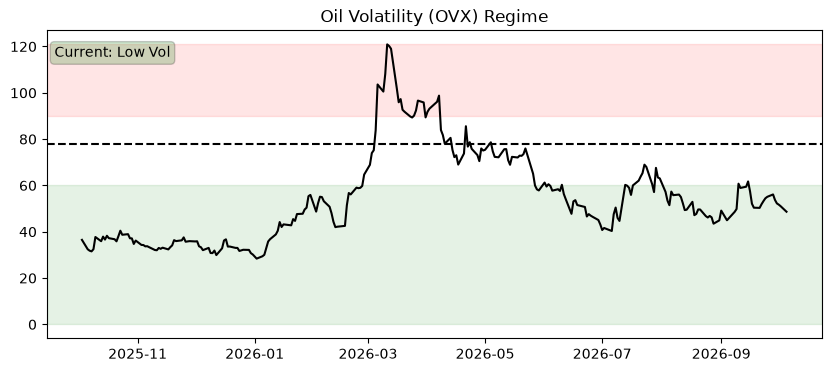
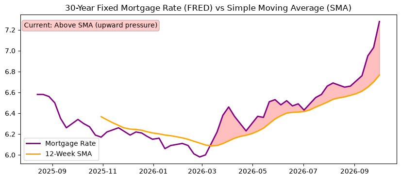
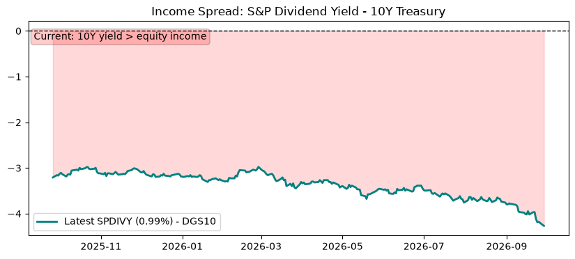

# Market Risk Monitor

**🟢 Recovery**  
**Score:** Downturn 0/3 | Recovery 3/3  
**Last Updated:** 2026-10-02

---

⚠️ **Disclaimer**

This is an automated market signal summary for informational purposes only.
It is not financial advice.

A note from the author:
There are hundreds of resources on the Internet in addition to learning resources available through your investment platform.
For example, [this one by Ramit Sethi](https://youtu.be/FF5-FbhaAyc?si=52cXbGUBFqxifu7Q), or [this one by Jaspreet Singh](https://youtu.be/qdqLIjszqy4?si=-R0Sa7C_Q0bCHY08), or [this one by Erin Moriarity](https://youtu.be/FYMfX3Aljow?si=MPQ7nICG0nA1U6vh), or articles like [this one by Fidelity](https://www.fidelity.com/learning-center/smart-money/roth-ira-taxes).
Seek out the information you need for your future self!

---

## AI Risk Commentary

- SPY price 763.99 is above its 200‑day moving average of 720.03, showing price is above the long‑term trend.  
- QQQ price 742.03 is above its 100‑day moving average of 717.42, showing price is above the intermediate‑term trend.  
- ARKK has risen 5.94% over the past three months, showing positive recent performance.  
- VIX is at 16.39, reflecting moderate implied volatility of the S&P 500.  
- OVX is at 51.69 and is classified as a low‑volatility regime, reflecting low short‑term expected volatility.  
- TNX yield is 5.24%, representing the 10‑year Treasury yield.  
- Mortgage rate is 7.28% with an “Unfavorable” condition, reflecting high financing costs.  
- Income spread shows a dividend yield of 0.99% versus a 10‑year Treasury yield of 5.29%, producing a spread of –4.3, which the regime labels “Bond Yield Advantage,” meaning the spread favors bonds over equities.  
- The positive price‑to‑moving‑average positions for SPY and QQQ combined with low VIX and OVX reflect low expected short‑term volatility despite the high mortgage rate.  
- The negative spread indicates that current equity dividend yield is lower than the 10‑year Treasury yield, favoring bonds.  
- Raw data is available in /data.

---

## Charts

### SPY Trend

### QQQ Trend

### ARKK Drawdown

### VIX

### MOVE

### 10Y Yield

### Oil Volatility

### Mortgage Conditions

### SPY Trailing Dividend Yield (proxy)

---

[View raw data](data/market_snapshot.json)

---

## RSS Feed

https://kam-reef.github.io/market-summary/feed.xml

---

## Data

- Signals: [data/signals.json](data/signals.json)  
- History: [data/history.json](data/history.json)
